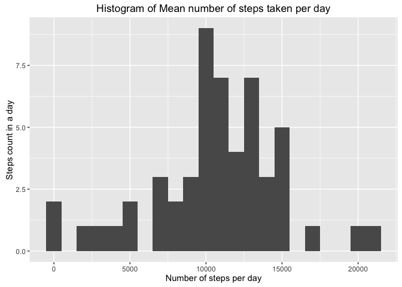
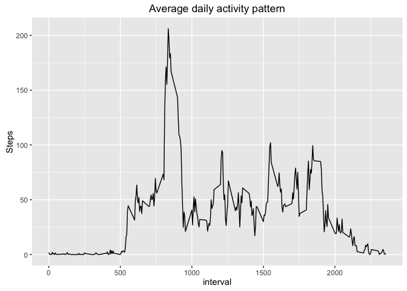
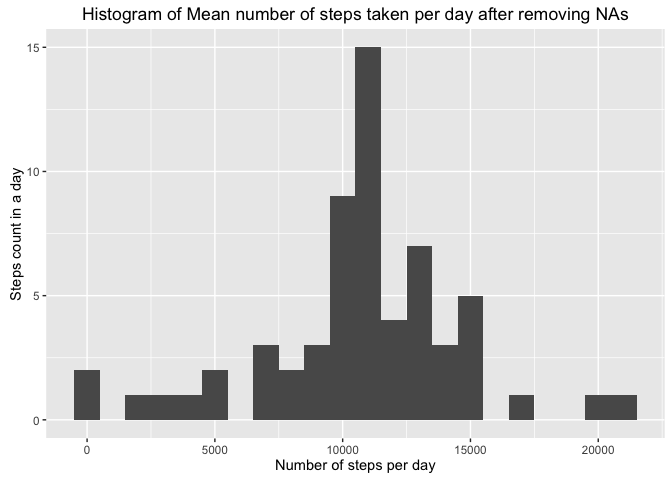
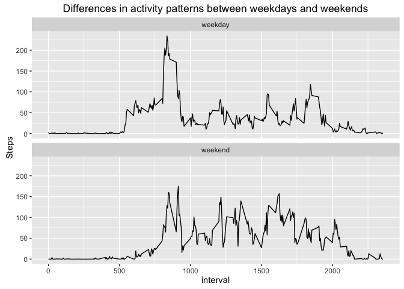

# Reproducible Research: Peer Assessment 1

## Loading and preprocessing the data


```r
if(!file.exists('activity.csv')){
  unzip('activity.zip')
}

data <- read.csv('activity.csv', header = TRUE,  colClasses = c("numeric", "character", "numeric"))
data$date <- as.Date(data$date, format = "%Y-%m-%d")
```

## What is mean total number of steps taken per day?


```r
library("ggplot2")
```

```
## Warning: package 'ggplot2' was built under R version 3.2.4
```

```r
steps_per_day <- aggregate(steps ~ date, data, sum)
histogram <- ggplot(steps_per_day, aes(steps)) + geom_histogram(binwidth = 1000)
histogram + labs(title="Histogram of Mean number of steps taken per day", 
         x = "Number of steps per day", 
         y = "Steps count in a day")
```



```r
mean(steps_per_day$steps)
```

```
## [1] 10766.19
```

```r
median(steps_per_day$steps)
```

```
## [1] 10765
```

## What is the average daily activity pattern?


```r
steps_per_interval <- aggregate(steps ~ interval, data, mean, na.rm = T)

time_series <- ggplot(steps_per_interval, aes(interval, steps))
time_series + geom_line() + labs(title = "Average daily activity pattern",
                                 y = "Steps")
```



```r
max_steps_interval <- steps_per_interval[which.max(steps_per_interval$steps), ]
max_steps_interval
```

```
##     interval    steps
## 104      835 206.1698
```

## Imputing missing values


```r
missing <- sum(is.na(data$steps))
missing
```

```
## [1] 2304
```

```r
steps_col <- numeric()
for(i in 1:nrow(data)){
  this_obs <- data[i, ]
  if(is.na(this_obs$steps)){
    steps <- subset(steps_per_interval, interval == this_obs$interval)$steps
  }
  else{
    steps <- this_obs$steps
  }
  steps_col <- c(steps_col, steps)
}

filled_data <- data
filled_data$steps <- steps_col

steps_per_day_filled <- aggregate(steps ~ date, filled_data, sum)
histogram <- ggplot(steps_per_day_filled, aes(steps)) + geom_histogram(binwidth = 1000)
histogram + labs(title="Histogram of Mean number of steps taken per day after removing NAs", 
                 x = "Number of steps per day", 
                 y = "Steps count in a day")
```



```r
mean(steps_per_day_filled$steps)
```

```
## [1] 10766.19
```

```r
median(steps_per_day_filled$steps)
```

```
## [1] 10766.19
```


## Are there differences in activity patterns between weekdays and weekends?


```r
days <- weekdays(data$date)
day_class <- vector()
for(i in 1:nrow(data)){
  if(days[i] == "Saturday" | days[i] == "Sunday"){
    day_class[i] <- "weekend"
  }
  else{
    day_class[i] <- "weekday"
  }
}

data$day_class <- day_class
steps_per_interveal_dc <- aggregate(steps ~ interval + day_class, data, mean, na.rm = T)

g <- ggplot(steps_per_interveal_dc, aes(interval, steps)) + geom_line() + facet_wrap( ~ day_class, nrow = 2, ncol = 1)
g + labs(title = "Differences in activity patterns between weekdays and weekends", 
         y = "Steps")
```


